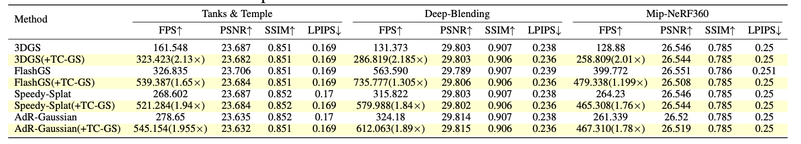

# TC-GS: A Faster and Flexible 3DGS Module Utilizing Tensor Cores

TC-GS is a flexible and fast library which can accelerate the ```renderCUDA``` process of 3DGS with Tensor Cores. It can be easily installed with various 3DGS kernels.

This repo is an example applying [Speedy-splat](https://speedysplat.github.io) with TC-GS. We have also apply TC-GS on other acceleration kernels and achieving remarkable speedup.

The code and usage of TC-GS is in ```submodules/tcgs_speedy_rasterizer/tcgs```.

## TODO
+ Release the Paper ✅ [paper](https://arxiv.org/pdf/2505.24796v2)(Preprint Version)
+ Support Training with Tensor Cores
+ Utilizing Tensor Cores on ```preprocessCUDA``` 

## Installation
```shell
git clone https://github.com/DeepLink-org/3DGSTensorCore --recursive
```

## Setup
```shell
conda env create --file environment.yml
```

## Evaluate The trained model
```shell
export DATA=[your_data_path]
export SCENE=[your_scene_name]
export CKPT=[your_checkpoint_path]

# export CUDA_VISIBLE_DEVICES=0

python render.py \
    -s ${DATA}/${SCENE}/ \
    -m ${CKPT}/${SCENE}/ \
    --eval 
```
or simply use the script
```shell
bash eval.sh
```
## Result
The result is evaluated on NVIDIA A800

